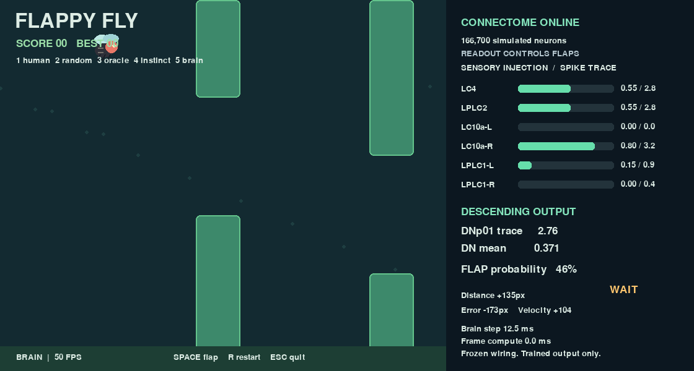

# Flappy Fly

A Flappy-style game controlled through a simulation of the adult male fruit-fly
central nervous system connectome. A trained readout uses activity from a frozen
fruit-fly connectome. **The biological fly did not learn Flappy Bird.**

```text
Game state → hand-designed sensory injection → frozen MaleCNS connectome
           → 1,314 descending-neuron traces → logistic readout → FLAP / WAIT
```

The installed real graph has **166,700 neurons and 25,582,938 connections**.


No fake network backs `brain` mode. The project is an experiment, not a claim that
the connectome outperforms ordinary controllers. See the measured results below.

## Quick start (Python 3.11)

```bash
python3.11 -m venv .venv
source .venv/bin/activate
python -m pip install -r requirements.txt
python scripts/play.py --mode human
```

For the exact development dependency versions use `requirements-lock.txt`.
Optional editable install: `python -m pip install -e .` (adds `flappy-fly`).

SPACE flaps, R restarts the same seed, ESC quits. Keys 1–5 switch between human,
random, oracle, instinct and trained brain; changing mode starts a fresh episode.
Brain mode needs `--model`. All modes share the same environment and physics.

```bash
python scripts/play.py --mode oracle
python scripts/play.py --mode random
python scripts/play.py --mode oracle --headless --seed 42
```

Human, random and oracle modes do not load flybrain or the connectome.
Pygame is imported only for visual play; collection/evaluation are headless.

## First real-brain demo

```bash
python scripts/inspect_brain.py
python scripts/play.py --mode oracle --monitor-brain
python scripts/play.py --mode instinct
```

The first brain load downloads about 260 MB of upstream checksum-verified data
into `data/brain/`; set `FLY_DATA` to choose another location. CPU is selected on
Apple Silicon. CUDA is supported only when flybrain reports an available NVIDIA
backend. The first step includes Numba compilation; steady-state timing appears
in the dashboard. No PyTorch or MPS assumptions are made.

The monitor demo lets the oracle keep the fly alive while real sensory injection
and measured DNp01 activity are displayed. **In monitor mode, the brain does not
control actions.** In `instinct` mode, the DNp01 trace threshold controls flapping;
in `brain` mode, the descending-neuron readout controls flapping.

The basic matched-noise inspection produced mean DNp01 trace 0 without stimulation
and 4.698 with LC4/LPLC2 stimulation 0.8. This verifies propagation in the simulation;
it does not establish biological realism or successful gameplay.
See [API notes](docs/flybrain_api_notes.md) and [inspection output](docs/brain_inspection.json).

## Reproduce the first experiment

```bash
python -m flappy_fly.cli collect --episodes 50 --seed 0 --max-steps 750 \
  --output data/datasets/oracle_v1.npz
python -m flappy_fly.cli train --dataset data/datasets/oracle_v1.npz \
  --output models/flap_readout_v1.npz
python -m flappy_fly.cli train --dataset data/datasets/oracle_v1.npz \
  --direct --output models/direct_readout_v1.npz
python -m flappy_fly.cli evaluate --model models/flap_readout_v1.npz \
  --direct-model models/direct_readout_v1.npz --episodes 30 --seed 10000 \
  --max-steps 750 --output data/runs/evaluation_v1.json
python scripts/play.py --mode brain --model models/flap_readout_v1.npz --seed 10051
```

`collect_data.py`, `train_readout.py`, and `evaluate.py` are wrapper scripts for the
same CLI commands. `--headless` is accepted for collection and evaluation; neither
opens a window. A 750-step cap is 15 simulated seconds, not 15 seconds of wall time.
Defaults allow 1,500 steps. Capped episodes are recorded as truncated, not deaths.

Datasets contain neural features, normalized raw inputs, full observable state,
injection values, DNp01 trace, oracle/actual actions, episode/step/seed, score and
split. JSON sidecars record configs, backend, package version, graph feature order,
seeds, class counts, timestamps, Git revision/dirty state and an NPZ SHA256 digest.
Models have their own sidecars; runtime rejects mismatched configs, feature order,
backend, package version or corrupted artifacts. Keep each NPZ with its JSON.

## Evaluation protocol

- Oracle seeds 0–34 train; 35–41 validate; 42–49 test. No adjacent-frame random split.
- WAIT is downsampled **only for fitting**. The 50-episode dataset contains 36,392
  samples, including 1,237 FLAP labels (3.40%). Held-out data retains that imbalance.
- The library readout uses all 1,314 descending traces as input, then a 20-component
  PCA and L2-regularized logistic regression. PCA/standardization are fitted inside
  training folds. Five diagnostic CV groups contain whole training episodes.
- Rank=20, L2=.1, threshold=.5 and cooldown=.12 s are fixed in advance. Validation
  and test metrics include FLAP precision, recall, F1 and a confusion matrix
  (rows true WAIT/FLAP, columns predicted WAIT/FLAP).
- The displayed probability is the logistic score of a **balanced-fit classifier**,
  not a calibrated estimate of natural FLAP frequency or confidence in survival.
- Closed-loop results use exactly the same 30 unseen seeds 10000–10029 for all
  controllers. The evaluator rejects seeds appearing in a model's dataset.
- Direct logistic sees three normalized inputs: urgency, signed gap error and signed
  velocity. It uses the same labels, splits, balancing, regularization and cooldown.

## Measured results

Initial 50-episode training, 30 unseen evaluation seeds, 15-second episode cap:

| Controller | Mean pipes | Median | Max | Mean survival |
|---|---:|---:|---:|---:|
| Random | 0.23 | 0 | 1 | 3.64 s |
| DNp01 instinct | 0.00 | 0 | 0 | 3.12 s |
| Direct logistic v1 | 0.00 | 0 | 0 | 3.53 s |
| Fly readout v1 | 0.07 | 0 | 2 | 3.31 s |
| Oracle | 6.70 | 7 | 7 | 14.65 s |

After one DAgger round (30 learner episodes / 4,857 new samples), fly readout v2
and direct logistic v2 both averaged **0.00 pipes**. Mean survival was 3.19 s and
3.50 s, respectively. DAgger did not improve the policy with these fixed settings.
[Recorded metrics and episodes](docs/results/evaluation_v2.json) include truncation
flags; [v1 results](docs/results/evaluation_v1.json) preserve the first comparison.

The initial fly readout did **not** outperform random on mean pipes. Its held-out
FLAP precision/recall/F1 were .104/.799/.183. Direct logistic achieved
.177/1.000/.301 yet failed in closed-loop play. These results illustrate why
classification metrics alone cannot validate a control policy. High recall with
low precision produces premature flaps and unfamiliar states. There is no claim
of statistically significant superiority from this small experiment.

## DAgger round

```bash
python -m flappy_fly.cli collect --episodes 30 --seed 1000 --max-steps 750 \
  --model models/flap_readout_v1.npz --output data/datasets/dagger_v1.npz
python -m flappy_fly.cli merge \
  --datasets data/datasets/oracle_v1.npz data/datasets/dagger_v1.npz \
  --output data/datasets/combined_v2.npz
python -m flappy_fly.cli train --dataset data/datasets/combined_v2.npz \
  --output models/flap_readout_v2.npz
python -m flappy_fly.cli train --dataset data/datasets/combined_v2.npz \
  --direct --output models/direct_readout_v2.npz
python -m flappy_fly.cli evaluate --model models/flap_readout_v2.npz \
  --direct-model models/direct_readout_v2.npz --episodes 30 --seed 10000 --max-steps 750 --output data/runs/evaluation_v2.json
```

The learner acts; a side-effect-free oracle query labels that exact state. Teacher
cooldown follows actions actually taken, rather than imaginary oracle flaps. Neural
features are reused from the learner's one brain advance, never simulated twice.
New episodes are training-only; original validation/test episodes remain untouched.
Merging rejects reused seeds or incompatible experiment settings. The same benchmark
seed set is reused for version comparison, so it is not a fresh final holdout for v2.

[Experiment ledger](docs/experiment_log.md) records development changes.
`configs/baseline_v1.json`, `trained_v1.json` and `trained_v2.json` preserve the exact
settings; v2 changes the dataset, not the physics or encoder. Supply `--config` to
play/collect/evaluate for explicit settings. Training inherits dataset settings.

## What is biological, simulated, and trained?

**Biological:** the connectivity graph comes from MaleCNS electron microscopy.
The package converts synapse counts into signed, normalized connection strengths;
these are not direct measurements of physiological weights.

**Simulated:** simplified leaky integrate-and-fire neurons, approximate transmitter
effects, hand-calibrated dynamics and noise. This is not a full fly emulation.

**Hand-designed:** urgency drives LC4/LPLC2; signed vertical error drives LC10a L/R;
signed velocity drives LPLC1 L/R. Left means below/falling and right means
above/rising. These arbitrary bilateral task channels are not claims about how
flies biologically encode Flappy gaps. Injection is bounded in [0,1] and logged.
No action label, oracle decision, or cooldown enters the encoder.

**Trained:** PCA/standardization and logistic output parameters only. The biological
connectome is frozen. No muscles, physical fly body, realistic eyes, or synaptic
plasticity are simulated. The output readout learns; a literal fly does not.

"CONNECTOME ONLINE" and the death-screen joke are presentation copy. Bars represent
input amplitudes and measured decaying spike counts. Visual smoothing never changes
the model. Instinct mode shows no probability because a trace threshold is not one.

## Debugging and reproducibility

The game is deterministic for a given seed/actions. Brain and trace use the verified
public `reset(seed)`/`reset()` methods for every episode. Noise seed equals game seed.
NumPy fitting seed, backend and thread count are logged; exact spikes need not match
across CUDA/CPU, thread counts or library versions. No private neural state is reset.

Death saves the last 100 decisions in `data/runs/death_*.json`, including error,
velocity, looming, DNp01, readout probability, actual and oracle actions. The death
screen plots recent neural/readout signals and action markers. Rendering is separate
from physics. If computation exceeds 20 ms, wall-time play slows; no neural decisions
are skipped and simulation dt stays fixed. Dataset collection runs without pacing.

```bash
python -m pytest -q
RUN_BRAIN_TESTS=1 python -m pytest -q -m brain
```

Ordinary tests cover physics, seed replay, collisions/scoring, encoder bounds,
teacher behavior, episode leakage, balancing, model round trips and dummy-driver UI.
Heavy tests load the real connectome, check feature shape, seeded trace replay and
unchanged weights. They are opt-in. Headless visual smoke check:

```bash
SDL_VIDEODRIVER=dummy SDL_AUDIODRIVER=dummy python scripts/play.py \
  --mode oracle --max-steps 100
```

## Attribution and licensing

- [flybrain / fly.ai](https://github.com/alextitonis/fly.ai), by alextitonis: MIT.
- [MaleCNS v1.0](https://male-cns.janelia.org/), FlyEM (HHMI Janelia), University of
  Cambridge, MRC Laboratory of Molecular Biology and Google Research:
  [CC BY 4.0](https://male-cns.janelia.org/download/). Please cite Berg, S. et al.
  (2026), *Sexual dimorphism in the complete connectome of the Drosophila male
  central nervous system*, *Cell*, as requested by the package authors.
- The package's neuron model follows [Fly64](https://github.com/ornata/fly) by
  Jessica Paquette.

Connectome files remain under their original data license and are not committed.
All game graphics are original Pygame shapes; no Flappy Bird artwork is included.
This repository does not modify or redistribute flybrain source. Its installed
license is preserved by pip; third-party licenses remain applicable.
